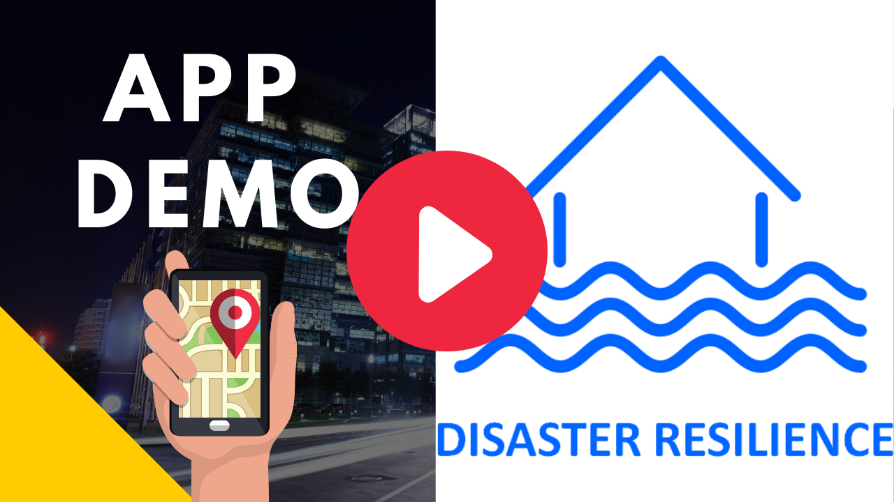
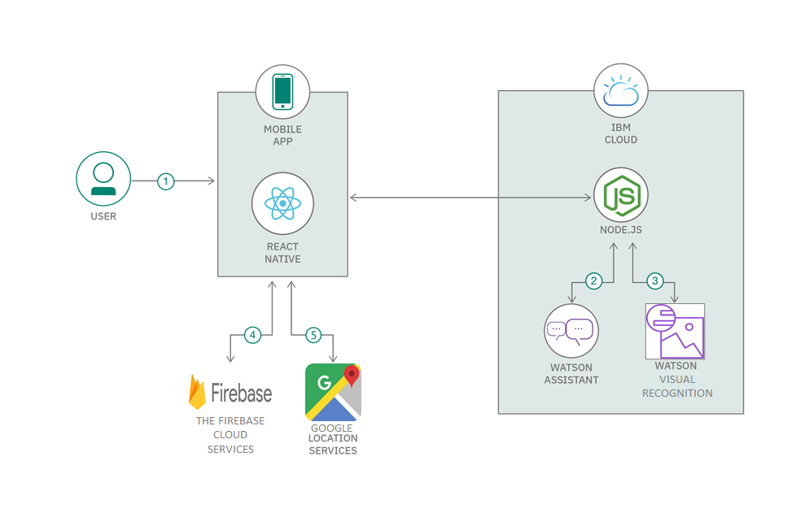
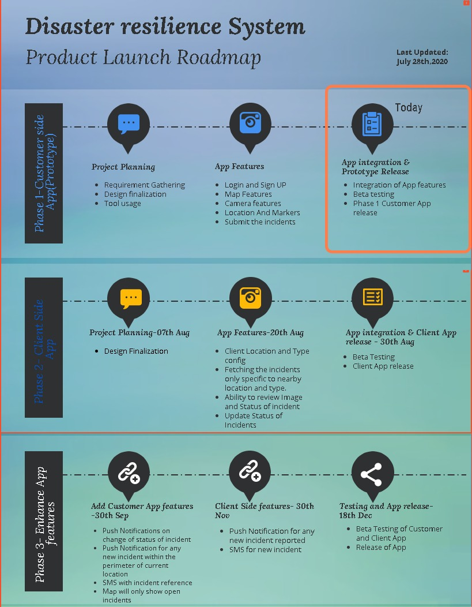

# Disaster-Resiliency-App

## Contents

1. [Description](#description)
1. [Demo video](#demo-video)
1. [The architecture](#the-architecture)
1. [Project roadmap](#project-roadmap)
1. [Getting started](#getting-started)
1. [Built with](#built-with)

## Description

### What's the problem?

In our daily life we may encounter some disasters which can be avoided if necessary action is taken on time. Whenever we come across any disasters, we feel it would have been for the best if we avoided those disasters in the first place. We may help a little bit if we reported such instances on time so that necessary actions are taken on time. 

### The idea

The idea is to develop a Mobile Application to report any disaster (water leakage/ fire/ bush fires/ toxic leakage/ flood etc.,) with the photo and the location of it. Based on the location and using the picture we send notification to the nearest concerned authorities to take action. We will also send notifications to the nearby people of the disaster if they opted to receive notifications from the application based on the location the disaster reported.

## Demo video

## The architecture

1.	The user launches the mobile app and can signup/ login to the app. Once logged in user will be shown with the Map with all the incidences raised nearby. User can report an incidence of disaster by taking photo and capturing location
2.	The user can ask questions to Watson Assistant and get answers on disaster planning and dos and donts etc.
3.	Watson Visual Recognition machine learning will analyze the picture taken and describe the image (Future plan, currently not implemented) 
4.	The photo and the location details along with the customer details are stored in database
5.	The user can obtain geolocation data for reporting the disasters and also find the nearby disasters with the help of Google location services.

## Project roadmap

## Getting started

These instructions will get you a copy of the project up and running on your local machine for development and testing purposes. See deployment for notes on how to deploy the project on a live system.

### Installing
Please use the apk file shared for installation

## Built with

* [IBM watson assistent](https://cloud.ibm.com/catalog/services/watson-assistant)
* [IBM cloud object storage](https://cloud.ibm.com/docs/cloud-object-storage?topic=cloud-object-storage-getting-started-cloud-object-storage) 
* [Expo client](https://expo.io/learn) 
* [React native app](https://reactnative.dev/docs/getting-started)
* [Firebase](https://firebase.google.com/docs)
* [Google location services API](https://developers.google.com/maps/documentation/geolocation/overview)